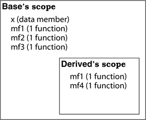

# Effective CPP

- [Effective CPP](#effective-cpp)
  - [实现 Implementations](#实现-implementations)
    - [条款 26：尽可能延后变量定义式的出现时间](#条款-26尽可能延后变量定义式的出现时间)
    - [条款 27：尽量少做转型动作](#条款-27尽量少做转型动作)
    - [条款 28：避免返回 handles 指向对象内部成分](#条款-28避免返回-handles-指向对象内部成分)
    - [条款 29：为“异常安全”而努力是值得的](#条款-29为异常安全而努力是值得的)
    - [条款 30：透彻了解 inlining 的里里外外](#条款-30透彻了解-inlining-的里里外外)
    - [条款 31：将文件间的编译依存关系降至最低](#条款-31将文件间的编译依存关系降至最低)
  - [继承于面向对象设计](#继承于面向对象设计)
    - [条款 32：确定你的 public 继承塑模出 is-a 关系](#条款-32确定你的-public-继承塑模出-is-a-关系)
    - [条款 33：避免遮掩继承而来的名称](#条款-33避免遮掩继承而来的名称)
    - [条款 34：区分接口继承和实现继承](#条款-34区分接口继承和实现继承)
    - [条款 35：考虑 virtual 函数以外的其他选择](#条款-35考虑-virtual-函数以外的其他选择)
    - [条款 36：绝不重新定义继承而来的 non-virtual 函数](#条款-36绝不重新定义继承而来的-non-virtual-函数)
    - [条款 37：绝不重新定义继承而来的缺省参数值](#条款-37绝不重新定义继承而来的缺省参数值)
    - [条款 38：通过复合塑膜存储 has-a 或“根据某物实现出”](#条款-38通过复合塑膜存储-has-a-或根据某物实现出)
    - [条款 39：明智而审慎地使用 private 继承](#条款-39明智而审慎地使用-private-继承)
    - [条款 40：明智而审慎地使用多重继承](#条款-40明智而审慎地使用多重继承)

## 实现 Implementations

### 条款 26：尽可能延后变量定义式的出现时间

- 只在需要的地方声明变量，防止无用的构造与析构。
- 条款 4 介绍的通过 default 构造一个对象后赋予其初值，比在构造时指定初值效率要差。因此尽可能在声明变量时指定初始值，跳过无意义的 default 构造。
- 对于循环中使用的局部变量定义应该放在循环外还是循环内：
  - 如果对象变量的一个赋值操作成本小于一组构造+析构成本那么就定义在循环外，反之放入循环内。

### 条款 27：尽量少做转型动作

- c++ 提供了 4 种新式的转型：
  - `const_cast<T>(expression)`：用来将对象的常量性移除。
  - `dynamic_cast<T>(expression)`：安全向下转型。
  - `reinterpret_cast<T>(expression)`：用来处理无关类型之间的转换。具体实现于与编译器有关，不具备移植性。
  - `static_cast<T>(expression)`：强迫隐式转换，类似 c 中的强转。

- 目前旧式转型依然合法，但是新式的转型更具有优势：
  - 新式转型可以很容易在代码中辨识出来，便于搜索和阅读。
  - 各转型动作的目标越细化，编译器就越可能帮助诊断错误运用。

- 函数型转型: `doSomeWork(const YourClass&);` 原型存在以下使用 `doSomeWork(YourClass(15)) == doSomeWork(static_cast<YourClass>(15))`，这两种情况是等效的。

- 有时当我们持有一个函数指针时，不要妄想通过知道对象内存布局来进行偏移实现某些操作，这对于不同编译器不同平台时不可移植的。

- 下边这种操作时错误的，它仅仅时作用在了强转产生的一个针对 this 指针父类资源的副本上。

```cpp
class Window { // base class

public:
    virtual void onResize() {... } // base onResize impl
    ...
};

class SpecialWindow : public Window { // derived class

public:
    virtual void onResize()
    {                                           // derived onResize impl;

        static_cast<Window>(*this).onResize();  // cast *this to Window,
                                                // then call its onResize;
                                                // this doesn't work!
        ...                                     // do SpecialWindow-
    }                                           // specific stuff
    ...
};
```

- dynamic_cast 转换慎用，**大部分的实现效率低下**（通过对 class 名称进行比对）。一般使用的情况都是在你想要将一个退化为基类的派生类指针，转换为派生类。

### 条款 28：避免返回 handles 指向对象内部成分

- 通常我们认为对象”内部“就是指它的成员变量，不对外公开的数据、使用的函数，因此当返回 handle 指向了这部分则会导致类的封装遭到破坏。

- 类方法返回`引用的方式`向外暴露对象内部成员时：
  - 首先会导致类成员的封装性降低，类成员的封装性最多只等于这个类方法的访问级别。
  - 并且当返回非 const 的引用，并且这个引用对象指向类成员时，调用者就可以直接修改掉对象类成员，而不用通过任何方法，导致封装被破坏。解决这个的问题则是将返回的类型限定为 const，避免使用者修改的危险。`相当于有限的放松了类成员的读权限`。

- 当返回指针、迭代器与引用存在的问题是一致的，破坏了类的封装性。

- 除了破坏类的封装性问题，返回 handle 指向类内部成分还存在更严重的问题即，空悬(dangling)。因此当使用指向类内部的 handle 时，必须注意对象的生命周期。

### 条款 29：为“异常安全”而努力是值得的

- 异常安全性即当有异常抛出时，函数会保证：
  - 不泄露任何资源；
  - 不允许数据被破坏：即已经被修改的成员或者状态当异常发生后，需要保证恢复到调用之前的状态。

- 异常安全函数提供以下三个保证之一：
  - 基本承诺：如果异常抛出，程序内的任何事物仍然保持在有效的状态下。但是当调用失败后无法确保当前函数处于哪种状态。
  - 强烈保证：如果异常抛出，程序的状态不会改变，即如果函数调用成功就是完全成功，失败就会回退到调用前的状态。
  - 不抛掷异常：承诺不抛出异常，能供完成承诺的功能。

- 实现强烈保证的异常安全：
  - 将堆内存资源、锁资源等等，通过智能指针以及资源管理类进行管理。
  - `不要为了标识某件事情发生而改变对象状态，除非那件事情真的发生了`。
    - 只有当已经具体事情执行完成后才进行修改标志事情的内部状态（计数器、标志位等等）相应操作。
  
- copy and swap 策略：对打算修改的对象进行拷贝，在其副本上进行修改，当所有操作成功后，再将修改的副本与元对象在一个不抛出异常的操作中进行置换（swap）。

```cpp
struct PMImpl {                         // PMImpl = "PrettyMenu

    std::tr1::shared_ptr<Image> bgImage; // Impl."; see below for

    int imageChanges;                   // why it's a struct  p132解释
};

class PrettyMenu {

    ····

private:
    Mutex mutex;

    std::tr1::shared_ptr<PMImpl> pImpl;
};

void PrettyMenu::changeBackground(std::istream& imgSrc)
{

    using std::swap;                        // see Item 25

    Lock ml(&mutex);                        // acquire the mutex

    std::tr1::shared_ptr<PMImpl>            // copy obj. data

        pNew(new PMImpl(*pImpl));

    pNew->bgImage.reset(new Image(imgSrc)); // modify the copy

    ++pNew->imageChanges;

    swap(pImpl, pNew);                      // swap the new

                                            // data into place

}                                           // release the mutex
```

- copy and swap 虽然对于对象状态的回退是个好办法，但是它并不能保证整个函数，尤其当函数内部调用了其他函数方法，那么就变成了木桶效应，整个函数的异常安全级别由最低的那个函数决定。

- 保证异常安全对于效率上的影响也是需要考虑的，有时刻意的提供强烈保证的异常安全导致的效率与复杂度对于其他人也是灾难的，因此效率、复杂度与将要提供的安全等级之间需要寻求平衡。

### 条款 30：透彻了解 inlining 的里里外外

- inline 函数不仅仅时免去了调用关系，还开放了编译器对代码的最优化能力。
- inline 函数的代价：目标码变大、降低 cache 命中率影响效率。
  - 但是换个角度说，如果 inline 函数的本体很小，那么编译器优化后的代码可能比针对函数调用所产生的代码更小，这就是向好的方向前进了。因此 inline 函数要尽量短小精悍。

- inline 函数通常置于头文件中由于 Inlining 大多发生在 C++ 程序的编译器，在进行替换时需要了解函数实现。Templates 通常置于头文件中也是相同原因，它一旦被使用编译器为了具现它需要了解其具体实现。

- 大部分编译器会拒绝复杂的函数（例如带有循环或递归）的函数 inlining，并且对于所有的虚函数都不会 inlining，这是因为虚函数是当运行期才决定调用哪个，而 inline 则是编译期进行替换因此编译器不知道该替换那个函数。因此一个表面上看似 inline 的函数是否真的 inlining，取决于你使用的编译器以及编译环境。

- 调用方式也会影响是否以 inlining 的方式调用：

```cpp
inline void f() {...}      // assume compilers are willing to inline calls to f
void (*pf)() = f;          // pf points to f

...

f();                      // this call will be inlined, because it's a "normal" call
pf();                     // this call probably won't be, because it's through
                          // a function pointer
```

- 构造函数与析构函数往往是 inlining 的糟糕候选人，即使是空的构造函数背后也有着很多工作大多由编译器实现，由编译器于编译期间产生并安插到你的程序中的代码，有时就放在你的构造和析构函数内。而这部分实现中可能会调用 base class 或者其他成员变量的构造，而这些调用均会影响编译器是否对此空白构造函数 inlining。

- 程序库中必须考虑 inline 函数所带来的耦合，一旦某个 inline 函数进行了修改，则所有用到这个函数的关联库都必须重新编译。

### 条款 31：将文件间的编译依存关系降至最低

- include 包括的头文件造成文件间的依赖关系。
- 使用前置声明注意的问题：
  - 不该声明标准程序库（类似 std::string 是一个模板实现 typedef 成为 string）。
  - 前置声明 class 编译器无法获取到对象的大小。

- 针对前置声明获取不到 class 大小的问题：
  - 可以将类分割为两部分，一个只提供接口，另一个负责具体实现该接口，这种设计就是 pimple idiom 也被成为 Handle class：

  ```cpp
    #include <string>                      // standard library components
                                           // shouldn't be forward-declared
    #include <memory>                      // for tr1::shared_ptr; see below

    class PersonImpl;                      // forward decl of Person impl. class
    class Date;                            // forward decls of classes used in
    class Address;                         // Person interface

    class Person {
    public:
        Person(const std::string& name, const Date& birthday,
                const Address& addr);

        std::string name() const;

        std::string birthDate() const;

        std::string address() const;
    ...
    private:                                     // ptr to implementation;

        std::tr1::shared_ptr<PersonImpl> pImpl;  // see Item 13 for info on

    };                                            // std::tr1::shared_ptr
  ```

  - 这种分离关键在于以 “声明的依存性” 替换 “定义的依存性”，这便是编译依存性最小化本质：现实中让头文件尽可能自我满足，如果做不到，则让它于其他文件内的声明式（非定义式）相依。
    - 如果使用 **引用** 或者 **指针** 可以完成任务，就不要使用 object 定义式。
    - 尽量以 class 声明式替换 class 定义式。
    - 为声明式和定义式提供不同的头文件。 

- 另一种 Handle class 的方法是令目标类成为一个 抽象基类，描述出接口通过派生具体实现，这种实现称为 Interface class。
  - 而使用时需要以抽象基类的指针或者引用来编写应用程序，这就需要一个构建方法工厂、组件等等用来得到 Handle。

- Handle classes 和 Interface classes 解除了接口和实现之间的耦合关系，从而降低了文件间的编译依赖性。但同样的它也存在的一些缺点：
  - 在 Handle classes 身上，成员函数通过 implementation pointer 取得对象数据，为每一次的访问增加了一层间接层，而每一个对象消耗的内存数量必须增加 implementation pointer，并且 implementation pointer 需要初始化，指向一个动态分配得来的 implementation object，所以必须承受动态内存分配于释放带来的消耗以及 bad_alloc 的异常可能。
  - 置于 Interface classes，由于每个函数都是 virtual，所以你必须为每次函数调用付出一个间接跳跃，此外还要承受 vptr（条款 7）等虚函数所带来的成本。
  - 不论 Handle classes 和 Interface classes 都不能充分利用 inline 函数，因为 inline 的具体实现都需要放入头文件内，而这两种方式均为了隐藏具体实现而努力。

## 继承于面向对象设计

### 条款 32：确定你的 public 继承塑模出 is-a 关系

- public 继承中：基类体现出一般化，派生类体现出特殊化。
- 语言于事实上的差异可能令继承关系显得不伦不类，就像企鹅于鸟的关系。但是具体的实现还是要看功能，假如你只考虑鸟喙、爪子等等，那么就不用但系企鹅与鸟的基类是否要由 fly 啦。
- public 继承意味着 is-a 。适用于 base classes 上的每一件事情一定适用于 derived classes 身上，因为每一个 derived class 对象也都是一个 base class 对象。

### 条款 33：避免遮掩继承而来的名称

- 众所周知😄 C++ 作用域就近原则，内层遮掩外层。而在继承关系中，派生类的成员函数内指向基类中的成员时，编译器可以找到相应的成员，这是由于派生类作用域被嵌套在基类的作用域内，



```cpp
class Base {
private:

  int x;

public:

  virtual void mf1() = 0;

  virtual void mf2();

  void mf3();
  ...
};

class Derived: public Base {
public:

  virtual void mf1();

  void mf4();
  ...
};

```

- 而当我们重载了基类的方法后，mf3 注意仅仅重载了无参数版本：

```cpp
class Base {

private:

  int x;

public:

  virtual void mf1() = 0;

  virtual void mf1(int);

  virtual void mf2();

  void mf3();

  void mf3(double);

  ...

};

class Derived: public Base {

public:

  virtual void mf1();

  void mf3();

  void mf4();

  ...

};
```

- 而这时进行调用，这就体现出了从名称查找的观点。这和本条款一开始展示的道理相同，当时函数 someFunc 内的 double x 遮掩了 global 作用域内的 int x，如今 Derived 内的函数 mf3 遮掩了一个名为 mf3 但类型不同的 Base 函数：

```cpp
Derived d;

int x;

...

d.mf1();                   // fine, calls Derived::mf1

d.mf1(x);                  // error! Derived::mf1 hides Base::mf1  可以看到派生类遮掩了基类的其他多态方法

d.mf2();                   // fine, calls Base::mf2

d.mf3();                   // fine, calls Derived::mf3

d.mf3(x);                  // error! Derived::mf3 hides Base::mf3 非虚的也是一样
```

- 那么该如何使用基类的其他不同参数的同名方法呢，这就可以使用 using 来在派生类中探查到基类内指定名称的方法。

```cpp
class Derived: public Base {

public:

  using Base::mf1;       // make all things in Base named mf1 and mf3

  using Base::mf3;       // visible (and public) in Derived's scope


  virtual void mf1();

  void mf3();

  void mf4();

  ...

};
```

- 而如果派生类是通过 private 继承基类时，并且仅仅想要继承 mf1 哪个无参数的版本，这时 using 就不能用了，因为它会导致所有 mf1 的函数在派生类作用域可见，这时就要用到一个转交函数：

```cpp
class Base {

public:

  virtual void mf1() = 0;

  virtual void mf1(int);

  ...                                    // as before

};

class Derived: private Base {

public:

  virtual void mf1()                   // forwarding function; implicitly

  { Base::mf1(); }                     // inline (see Item 30)
  ...

};

...

Derived d;

int x;

d.mf1();                               // fine, calls Derived::mf1

d.mf1(x);                              // error! Base::mf1() is hidden
```

### 条款 34：区分接口继承和实现继承

- 派生类所继承的内容包括：函数接口继承与函数实现继承，可能存在的继承情况：
  - 派生类只继承接口的声明。
  - 同时继承接口与实现，但对某个接口实现还要可以 override。
  - 继承接口与实现不允许 override。

- 抽象基类总是对 public 继承的派生类起到影响：
  - 声明一个 pure virtual 函数的目的是为了让派生类只继承函数接口。但是我们还可以对纯虚函数提供具体实现定义，调用的唯一途径是明确指出其 class 名称。
    - 成员函数的接口总是会被继承，所有抽象基类的接口在 public 继承的情况下遵循 is-a 关系，其接口应该对所有派生类有效。
  - 声明一个 impure virtual 非纯虚函数的目的是让派生类继承该函数的接口和缺省实现。
    - 但是允许 impure virtual 函数同时指定函数声明和函数缺省行为，可能导致新增派生类时忘记新增 override 该函数造成错误，而这种错误只有在运行期间才会被发现。
  - 因此我们需要切断 virtual 函数接口和其缺省实现之间的联系，除非明确要求继承基类的默认实现。

  ```cpp
    class Airplane {
    public:

    virtual void fly(const Airport& destination) = 0;
    ...
    protected: //因为它时 Airplane 以及 derived classes 的实现细目

        void defaultFly(const Airport& destination);

    };

    void Airplane::defaultFly(const Airport& destination)
    {

        //default code for flying an airplane to the given destination

    }

    // 若想使用缺省实现，可以在 fly 函数中对 defaultFly 做一个 inline 调用
    class ModelA: public Airplane {
    public:

    virtual void fly(const Airport& destination)
        { defaultFly(destination); }

        ...
    };

    class ModelB: public Airplane {
    public:

        virtual void fly(const Airport& destination)
        { defaultFly(destination); }

        ...
    };
  ```

  - 上述的方法存在一个问题便是由于分别提供接口与缺省实现，可能由于过度雷同的命数名称引起命名空间污染，因此我们可以利用 pure virtual 函数必须在 derived classes 中重新声明，但是纯虚函数也可以拥有自己的实现特性。
    - 如果合并 fly 和 defaultFly，就丧失了“让两个函数享有不同保护级别”的机会。

  ```cpp
    class Airplane {

    public:
        virtual void fly(const Airport& destination) = 0;

        ...
    };

    void Airplane::fly(const Airport& destination) // an implementation of
    { // a pure virtual function

        default code for flying an airplane to the given destination

    }

    class ModelA : public Airplane {

    public:
        virtual void fly(const Airport& destination)
        {
            Airplane::fly(destination);
        }

        ...
    };

    class ModelB : public Airplane {

    public:
        virtual void fly(const Airport& destination)
        {
            Airplane::fly(destination);
        }

        ...
    };

    class ModelC : public Airplane {

    public:
        virtual void fly(const Airport& destination);

        ...
    };

    void ModelC::fly(const Airport& destination)
    {

        code for flying a ModelC airplane to the given destination

    }
  ```

- 声明 non-virtual 函数的目的时为了令 derived classes 继承函数的接口及一份强制性实现。

### 条款 35：考虑 virtual 函数以外的其他选择

- 籍由 Non-Virtual hInterface 手法实现 Templat Method 模式：
  - 及通过一个 public 非虚接口隐藏掉虚接口具体的调用实例，并且可以灵活的按要求调用相关虚接口，这种方法称为 NVI (Non-Virtual hInterface)。
  
  ```cpp
    class GameCharacter {

    public:
        int healthValue() const // derived classes do not redefine
        { // this — see Item 36

            ...; // do "before" stuff — see below

            int retVal = doHealthValue(); // do the real work

            ...; // do "after" stuff — see below

            return retVal;
        }

        ...;

    private:
        virtual int doHealthValue() const // derived classes may redefine this
        {

            ...; // default algorithm for calculating

        } // character's health
    };
  ```

  - NVI 手法优势便是派生类有权重写 virtual 的 doHealthValue 方法具体的实现，但是基类的 healthValue 对外方法接口保留了调用的方法一致性。

- 籍由 Function Pointers 实现 Strategy 模式
  - Function Pointers 手法便是以传入函数指针的特性来实现 virtual 派生类各自实现的多样性。以 NVI 中的例子便是 doHealthValue 接口用外部传入的计算方法函数指针代替。

  ```cpp
    class GameCharacter; // forward declaration

    // function for the default health calculation algorithm

    int defaultHealthCalc(const GameCharacter& gc);

    class GameCharacter {

    public:
        typedef int (*HealthCalcFunc)(const GameCharacter&);

        explicit GameCharacter(HealthCalcFunc hcf = defaultHealthCalc)
            : healthFunc(hcf)

        {
        }

        int healthValue() const

        {
            return healthFunc(*this);
        }

        ...

    private :
        HealthCalcFunc healthFunc;
    };
  ```

  - 与 NVI 相比的特点：
    - 同一人物类型之间可以有着不同的 `健康计算函数`；
    - 某一只任务的 `健康计算函数` 可以在运行期变更；
  - 存在的问题：
    - 如果需要获取目标任务的 non-public 接口提供的数据，便存在无法获取的问题；
    - 一般解决上边的问题首先想到的便是`弱化 class 封装`使用 friends 友员，这便是使用时需要权衡的。

- 籍由 tr1::function 完成 Strategy 模式
  - 上述的两种方法 NVI 与 function ptr 对于模板来似都存在死板的局限性。使用 tr1::function 可以持有任何可调用物（函数指针、函数对象、或成员函数指针），只要其签名式兼容于需求端。
  
  ```cpp
    class GameCharacter;                                 // as before
    int defaultHealthCalc(const GameCharacter& gc);      // as before

    class GameCharacter {
    public:

    // HealthCalcFunc is any callable entity that can be called with
    // anything compatible with a GameCharacter and that returns anything
    // compatible with an int; see below for details
    // 这里的函数签名便是 返回一个 int 接受一个 const GameCharacter 的引用签名
    typedef std::tr1::function<int (const GameCharacter&)> HealthCalcFunc;

    explicit GameCharacter(HealthCalcFunc hcf = defaultHealthCalc)
    : healthFunc(hcf)
    {}

    int healthValue() const
    { return healthFunc(*this);   }

    ...

    private:
        HealthCalcFunc healthFunc;
    };


    EvilBadGuy ebg1(calcHealth);                        // character using a
                                                        // health calculation
                                                        // function
  ```

  - tr1::function 可以兼容符合函数签名的各种函数指针:

  ```cpp
    short calcHealth(const GameCharacter&); // health calculation
                                            // function; note
                                            // non-int return type

    struct HealthCalculator {                       // class for health
        int operator()(const GameCharacter&) const  // calculation function
        {
            ...
        }                                           // objects
    };

    class GameLevel {
    public:
        float health(const GameCharacter&) const;   // health calculation
        ...                                         // mem function; note
    };                                              // non-int return type

    class EvilBadGuy : public GameCharacter {       // as before
        ...
    };

    class EyeCandyCharacter : public GameCharacter {    // another character
        ...                                             // type; assume same
    };                                                  // constructor as

    // EvilBadGuy
    EvilBadGuy ebg1(calcHealth);    // character using a
                                    // health calculation
                                    // function

    EyeCandyCharacter ecc1(HealthCalculator()); // character using a
                                                // health calculation
                                                // function object
    GameLevel currentLevel;
    ...

    EvilBadGuy ebg2(                        // character using a
        std::tr1::bind(&GameLevel::health,  // health calculation
                        currentLevel,       // member function;
                        _1)                 // see below for details
    );
  ```

  - 在使用 GameLevel class 的成员函数 health 时，由于他是成员函数会有一个隐藏的参数就是 this，因此需要转换，这就是 std::tr1::bind 的作用了。

- 古典 Strategy 模式
  - 使用一个计算类方法，通过派生实现不同的计算方法，统一传入需要的地方。

  ```cpp
    class GameCharacter;                            // forward declaration
    class HealthCalcFunc {
    public:
        ...
        virtual int calc(const GameCharacter& gc) const
        { ... }
        ...
    };

    HealthCalcFunc defaultHealthCalc;

    class GameCharacter {
    public:
        explicit GameCharacter(HealthCalcFunc *phcf = &defaultHealthCalc)
        : pHealthCalc(phcf)
        {}

        int healthValue() const
        { return pHealthCalc->calc(*this);}

        ...
    private:
        HealthCalcFunc *pHealthCalc;
    };
  ```

### 条款 36：绝不重新定义继承而来的 non-virtual 函数

```cpp
class B {
public:
    void mf();
    ...
};

class D : public B {
    ...
};

// Even without knowing anything about B, D, or mf, given an object x of type D,
D x; // x is an object of type D

// you would probably be quite surprised if this,
B* pB = &x; // get pointer to x
pB->mf(); // call mf through pointer

//behaved differently from this :

D* pD = &x; // get pointer to x
pD->mf(); // call mf through pointer

```

- 注意派生类 D 中覆写了基类 B 中的同名 mf 方法，导致的问题便是同一个派生类指针，转为基类后调用的同名方法变为了基类中的 mf 方法，造成这种两面行为是由于 non-virtual 函数如 B::mf 和 D::mf 都是静态绑定的，通过什么类型调用就是其类型所定义的版本。另一方面 virtual 函数时动态绑定，所以即使转成了基类类型，最终通过虚函数表还是会调用到原始指针类型所定义的方法上。
- 另一个问题便是 D 的行为于 B 出现了分歧，不再符合了 public 继承的 is-a 原则：
  - 适用于 B 对象的每一件事情，都适用于 D，因为每一个 D 对象都是一个 B 对象；
  - B 的 derived classes 一定会继承 mf 的接口和实现，因为 mf 时 B 的一个 non-virtual 函数。

### 条款 37：绝不重新定义继承而来的缺省参数值

- 由于默认参数静态绑定，因此在派生类中重复指定默认参数时无效的，最终依旧会使用基类中的指定默认参数。
- 这么做的原因便是效率，如果想要类似 virtual 接口一样动态绑定便会扩大虚表。

- 如果想要给 virtual 接口加上默认参数，可以使用 NVI 手法来增加。

### 条款 38：通过复合塑膜存储 has-a 或“根据某物实现出”

- 复合（composition）是类型之间的一种关系，当某种类型的对象内含其他类型的对象，便是这种关系。“public” 继承标识者 is-a 关系，而复合便是 has-a 或者 is-implemented-in-terms-of （根据某物实现出）。在应用域（application domain），复合意味着 has-a （有一个）。在实现域（implementation domain），复合意味着 is-implemented-in-terms-of （根据某物实现出）。

### 条款 39：明智而审慎地使用 private 继承

- private 继承与 public 继承存在许多差异：
  - 不会自动将 derived class 转化为 base class。
  - 继承来的成员、方法，权限均为 private。

- private 意味着 is-implemented-in-terms-of （根据某物实现出）。派生类与父类之间的关系并不大。Private 继承在软件 “设计”层面上没有意义，其意义只及于软件实现层面。与**复合**在实现域一样，我们需要知道尽可能使用复合，必要时才使用 **private 继承**。
  - 当实现某些功能时需要一些其他类辅助，但是这两个类之间并非 is-a 的关系，这时便可以使用 private 继承。

- 还可以考虑如书中 p189 展示的 复合 + public 继承的方式来避免 private 继承，至于避免 private 继承的好处：
  - 可以防止 derived class 重新定义某些接口，如果通过 private 继承其无法防止派生类去重新定义 virtual 函数，但是如果通过 private 复合成员，其派生类无法取用便没有办法在重新定义了。
  - 不使用编译的依赖程度可以降低。

- 和复合不同，private 继承可以用来实现 empty base 最优化。这对致力于“对象尺寸最小化”的程序库开发者来说可能会很有用。

### 条款 40：明智而审慎地使用多重继承

- 多重继承比单一继承更加复杂，它可能导致新的歧义性，以及对 virtual 继承的需要。
- virtual 继承会增加大小、速度、初始化复杂度等等成本，如果 virtual base classes 不带任何数据，将是最具实用价值的情况。
- 多重继承的确有政党用途。例如涉及 public 继承某个 interface class 和 private 继承某个协助实现的 class 的两项组合。
